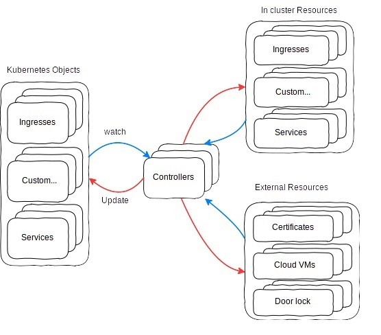

# Kubernetes Python Operator example 

# Table of Contents
1. [Introduction](#kubernetes-python-operator-example)
2. [Pre-Requisites](#prerequisites)
3. [What is an Operator, and Why Write It with Python?](#what-is-an-operator-and-why-write-it-with-python)
4. [Introducing the Operator Blackadder](#introducing-the-operator-blackadder)
5. [Creating a CustomResourceDefinition](#creating-a-customresourcedefinition)
6. [Adding the Controller Logic](#adding-the-controller-logic)
7. [Testing the Controller Logic](#testing-the-controller-logic)
8. [Creating the Docker Image and Manifests](#creating-the-docker-image-and-manifests)
9. [Deployment and Verification](#deployment-and-verification)

## PreRequisites:
* Docker up and running
* A kubernets cluster up and running. I am using kind here for semplicity see [KIND](../kind/README.md)
## What is an Operator, and why write it with Python?
[Ref: https://www.spectrocloud.com/blog/writing-kubernetes-operators-with-python]  
[Ref: https://github.com/spectrocloud/blackadder/blob/main/k8s/blackadder-crd.yml]

Kubernetes is de facto the platform for deploying applications using Linux containers.  
Originally developed by Google, to deploy web applications on a cluster of computers,   
it is now open source code. The developers of Kubernetes allowed extending the API of  
Kubernetes from very early versions, and today Kubernetes can deploy more than just  
Linux containers. It can deploy Virtual Machines, using KubeVirt, FreeBSD Jails, and even  
whole Kubernetes clusters using the Cluster API.  

Very early on in the Kubernetes developers realized that allowing to extend Kubernetes   
is key to successful adoption. Version **1.7* added the ability to define ThirdPartyResource,  
which allowed extending Kubernetes. These were later named CustomResourceDefinition  
in version 1.8 and onward.  

While Golang is the dominant language in the Kubernetes ecosystem, nothing stops  
you from writing components in other languages, as long as they fulfill the API.  
For example, one can replace runc, written in Go, with crun, which is written in C,  
as both implement the OCI Container Runtime specifications. Or you can replace  
the Kubelet with Krustlet, written in Rust, as it fulfills the Kubelet API.  

Hopefully, this is enough to convince you that you do not need to know Golang  
to extend Kubernetes. In this article, we will see how to extend the Kubernetes  
API and schedule our own workloads based on these newly defined API extensions  
using Python.

If you are reading this magazine, there is a high chance you already know Python  
or at least interested in it. But that is not all, Python is the most popular   
language according to some surveys, and it is also very popular in introductory   
programming courses in Universities. Hence, using Python to extend Kubernetes   
is likely to be easy for you and other team members who might already know   
Python and are less likely to know Go.  

By now, you already know that Kubernetes can schedule more than just Containers,   
and that you can extend the API with your own Custom Resource Definition.   
However, you might still ponder with the question: what is an Operator?  

***An operator is a collection of domain specific custom resources and a controller program***   
***to react to changes to the cluster or these specific resources.***  

For example, an operator can watch certain annotations on Pods or Deployments, and  
manipulate objects inside or outside the cluster when these annotations are detected.  
This is how CertManager or ExternalDNS work for example. Specifically, when you create  
an annotation on an Ingress, there is a chain of actions, which is triggered inside  
and outside the cluster. Along the process a certificate request is sent to LetEncrypt  
and if authenticated successfully a new secret containing a certificate is created and used  
to secure access to the Ingress with HTTPS. The key message here is that:  

***An operator can watch Kubernetes objects, built-in or custom, and act on objects,***  
***which can be external or internal to the cluster, bringing them to a desired state***  

.


## Introducing the operator Blackadder
We are going to write a small chaos engineering operator, which will produce havoc in the cluster.  
As with all operators, it needs a name. The *blackadder* is named after the Chaotic Baron  
in the [BBC Sitcom with the same name](https://en.wikipedia.org/wiki/Blackadder).  

***Chaos Engineering is the discipline of experimenting on a system in order to build confidence***  
***in the system’s capability to withstand turbulent conditions in production.***  

There are some pretty[mature operators which can create havoc in Kubernetes](https://github.com/litmuschaos/chaos-operator).  
Don’t dare running this operator in a Production cluster, unless of course all your applications   
are already cloud native and chaos resistant. 
Our operator will randomly kill pods and write garbage inside ConfigMaps.  
In addition, it will scale deployments to many replicas randomly.

To write a Kubernetes Operator, we can use the official Python client or any other alternative client,  
or any Python library can communicate with the kube-api-server via HTTP.  
For this article, I will be using [pykube-ng](https://codeberg.org/hjacobs/pykube-ng), which is self-described as a lightweight client library   
for the Kubernetes API.  
Personally, I like using it, because it feels more pythonic than the [official Python Client for Kubernetes](https://github.com/kubernetes-client/python).

## We start by creating a CustomResourceDefinition
***k8s/blackadder-v1alpha1.yml***
```
apiVersion: apiextensions.k8s.io/v1
kind: CustomResourceDefinition
metadata:
  name: chaosagents.blackadder.io
spec:
  group: blackadder.io
  scope: Cluster  # a CRD can also be Namespaced
  names:
    plural: chaosagents
    singular: chaosagent
    kind: ChaosAgent
    shortNames:
    - ca
  versions:
  - name: v1alpha1  # you can serve multiple versions e.g v1beta2 or v1alpha1
    served: true
    storage: true
    schema:
      openAPIV3Schema:
        type: object
        properties:
          spec:
            type: object
            properties:
              tantrumMode:
                type: boolean
              podTolerance:
                type: integer
    additionalPrinterColumns:
    - name: Tantrum
      type: boolean
      description: Kills Pods randomly
      jsonPath: .spec.tantrumMode
    - name: Tolerance
      type: integer
      description: Total number of Pod to tolerate before randomly killing Pods
      jsonPath: .spec.podTolerance
```

This will create a new Custom Resource of kind *ChaosAgent**. This new resouce has attibutes
* ***tantrumMode***: a Boolean that is used to acivate the random kill_pod functionality.
* ***podTolerance*** : an Intege that define the total number of Pod to tolerate before randomly killing Pods
We can now create the new Custom Resource Definition in our kubernetes cluster
```
$ kubectl apply -f k8s/blackadder-v1alpha1.yml
customresourcedefinition.apiextensions.k8s.io/chaosagents.blackadder.io created

$ kubectl  get crds
NAME                        CREATED AT
chaosagents.blackadder.io   2024-11-29T09:52:46Z
```
And create one of such resource with the following YAML file  
***k8s/edmund.yml***
```
apiVersion: blackadder.io/v1alpha1
kind: ChaosAgent
metadata:
  name: princeedmund1
spec:
  tantrumMode: true
  podTolerance: 10
```

We create here a ChaosAgent  Resoruce named *princeedmund1*, and as we can see it ha the two above mentioned properties. 
```
$kubectl apply -f k8s/edmund.yml
chaosagent.blackadder.io/princeedmund1 created

get chaosagents
NAME            TANTRUM   TOLERANCE
princeedmund1   true      10

```
We can add more toggles and switches and definitions to our CustomResourceDefintion for example as int he below YAML file.
Here we define two version of the CRD: 
* *v1alpha1* with the previous defined properties *tantrumMode* and *tantrumMode*
* *v1beta1* whith extra properties such as *cancerMode*, *ipsumMode*, *eagerness*, *pauseDuration* and *excludedNamespaces*
For description of the meaning of these new properties see the *additionalPrinterColumns* section of the new Custom Resource Definiation YAML file:  

***blackadder-cred.yml***
```
apiVersion: apiextensions.k8s.io/v1
kind: CustomResourceDefinition
metadata:
  name: chaosagents.blackadder.io
spec:
  group: blackadder.io
  scope: Cluster  # a CRD can also be Namespaced
  names:
    plural: chaosagents
    singular: chaosagent
    kind: ChaosAgent
    shortNames:
    - ca
  versions:
  - name: v1alpha1  # you can serve multiple versions e.g v1beta2 or v1alpha1
    served: true
    storage: false
    schema:
      openAPIV3Schema:
        type: object
        properties:
          spec:
            type: object
            properties:
              tantrumMode:
                type: boolean
              podTolerance:
                type: integer
    additionalPrinterColumns:
    - name: Tantrum
      type: boolean
      description: Kills Pods randomly
      jsonPath: .spec.tantrumMode
    - name: Tolerance
      type: integer
      description: Total number of Pod to tolerate before randomly killing Pods
      jsonPath: .spec.podTolerance
  - name: v1beta1  # you can serve multiple versions e.g v1beta2 or v1alpha1
    served: true
    storage: true
    schema:
      openAPIV3Schema:
        type: object
        properties:
          spec:
            type: object
            properties:
              tantrumMode:
                type: boolean
              podTolerance:
                type: integer
              cancerMode:
                type: boolean
              ipsumMode:
                type: boolean 
              eagerness:
                type: integer
                minimum: 1
                maximum: 100
              pauseDuration:
                type: integer
              excludedNamespaces:
                type: array
                items:
                  type: string           
    additionalPrinterColumns:
    - name: Tantrum
      type: boolean
      description: Kills Pods randomly
      jsonPath: .spec.tantrumMode
    - name: Tolerance
      type: integer
      description: Total number of Pod to tolerate before randomly killing Pods
      jsonPath: .spec.podTolerance
    - name: Cancer
      type: boolean
      jsonPath: .spec.cancerMode
      description: Scales deployments randomly
    - name: Ipsum
      jsonPath: .spec.impsumMode
      description: If active, it writes the content of ConfigMaps with random lorem ipsume strings.
      type: boolean
    - name: Eagerness
      type: number
      jsonPath: .spec.eagerness
      description: The probabilty of killing a Pod
    - name: Pause
      type: integer
      jsonPath: .spec.pauseDuration
      description: The pause in seconds after each cycle of actions
    - name: Excluded
      jsonPath: .spec.excludedNamespaces
      description: Which Namespace to exclude
      type: string

```
Note also, that CustomResourceDefinition can do various type input validation,  
for example we can define eagerness as an integer ranging from 1 to 100:

We can now apply the new Custom Resource definition and create the *v1beta1* version of the ChaosAgent
```
$ kubectl apply -f k8s/blackadder-crd.yml
customresourcedefinition.apiextensions.k8s.io/chaosagents.blackadder.io configured

$ kubectl apply -f k8s/edmund-v1beta1.ymlkubectl apply -f k8s/edmund-v1beta1.yml
chaosagent.blackadder.io/princeedmund1 configured

$ kubectl get ChaosAgent
NAME            TANTRUM   TOLERANCE   CANCER   IPSUM   EAGERNESS   PAUSE   EXCLUDED
princeedmund1   true      10          true             20          30      ["kube-system","chaos-operator","local-path-storage","kube-node-lease"]
```
The ChaosAgent Resource have most of the propertied set to true and also is instructed to exclude kube-system, chaos-operator, local-path-storage and kube-node-lease from the namespaces to look for pods , deployments and cofigmap

You can find the complete definition of the chaosagents manifests for creating agents [here](../k8s/blackadder-v1alpha1.yml) 

## Adding the controller logic
We have now created a new resource that is stored in Kubernetes and served by* kube-api-server*. 
Hence, we can now create the controller logic.  
We begin by drafting an algorithm in pseudocode which will explain the intended behavior of the chaos agent:
```
# Get a kubernets client
client = connect_to_kubernetes()

# retrieves our agent configuration from the kube-api-server
chaos_agent = client.get_chaos_agent()

while True:
    # Get all pods escluding those in exclude_namespaces
    pods = client.list_pods(exclude_namespaces)

    # Get all deployments escluding those in exclude_namespaces
    deployments = client.list_deployments(exclude_namespaces)

    # Get all configmaps escluding those in exclude_namespaces
    configmaps = client.list_configmaps(exclude_namespaces)

    # if tantrum is true then kill random pods
    if chaos_agent.tantrum:
        randomly_kill_pods(pods, chaos_agent.tolerance, chaos_agent.eagerness)

    # if cancer is true then scale pods randomly
    if chaos_agent.cancer:
        randomly_scale_deployments(deployments, chaos_agent.eagerness)

    # if tantrum then put random content in configmaps
    if chaos_agent.c:
        randomly_write_configmaps(configmaps, chaos_agent.eagerness)

    time.sleep(chaos_agent.pause)
```

The algorithm is pretty naive, but it’s got all the basics of a Kubernetes operator. Obviously, if you put it under a magnifying glass, there are a lot of obvious possible improvements.   
For example, for a cluster with hundreds of ConfigMaps and Pods each cycle can take a long while to complete, especially if cancer mode, which randomly scales up Deployments, is also active. However, we are not in the business of premature optimization, so we’ll ignore these limitations, and continue to the actual implementation in Python.

1. The first thing we need to do, is to get a Kubernetes client so that we can communicate with kube-api-server:
    * Take kubernernet configuration from the environment path of the config file  specified by KUBECONFIG or by default from  *~/.kube/config* 
        ```
        config = pykube.KubeConfig.from_env()
        ```

    * Assigns a custom function list_objects to the list_objects method of the HTTPClient class from the pykube library 
    The existing list_objects method of the HTTPClient class is being overridden with a new implementation provided by 
    the list_objects function. This can be used to create filters on the objects when *list_object* is called. by the HTTPClient instance
        ```
        pykube.HTTPClient.list_objects = list_objects
        ```
    * It creates an instance of the HTTPClient class from the pykube library to interact with the Kubernetes API server
        ```
        api = pykube.HTTPClient(config)
        ```

2. We create the generic list_object method and add it to the client instance.
    ```
    # List kubernetes objects with exclusion of namespaces
    def list_objects(self, k8s_obj, exclude_namespaces):
        exclude_namespaces = ",".join("metadata.namespace!=" + ns for ns in exclude_namespaces)
        return list(k8s_obj.objects(api).filter(namespace=pykube.all, field_selector=exclude_namespaces))
    ```
3. We now have all that is needed to create the complete controller of a ChaosAgent:
    * Create a Custom Resource object that represent the ChaosAgent custom Resource. This class can be then used to
      create, read, update and delete ChaosAgents resources in the Kubernetes cluster.
        ```
        ChaosAgent = pykube.object_factory(api, "blackadder.io/v1beta1", "ChaosAgent")
        ```
    * Converts the spec section of the agent object's Kubernetes resource definition into a more convenient format using the munch library.  
    The **munch** library is a Python library that provides a **Munch** class, which is a dictionary that supports attribute-style access.  
    This means you can access dictionary keys as if they were attributes of an object. It is particularly useful for making code more readable and convenient when dealing with nested dictionaries as shown bellow to get the exluded namespace property from ChaosAgent opbject
        ```
        agent.config = munch.munchify(agent.obj["spec"])
        exclude_namespaces = agent.config.excludedNamespaces
        ```
    * Here is the main loop fo the controller, for now the chaos functions are not implemented but just return.
        ```
        def randomly_kill_pods(pods, tolerance, eagerness):
        pass

        def randomly_scale_deployments(deployments, eagerness):
        pass

        def randomly_write_configmaps(configmaps, eagerness):
        pass

        while True:
            pods = api.list_pods(exclude_namespaces)
            deployments = api.list_deployments(exclude_namespaces)
            configmaps = api.list_configmaps(exclude_namespaces)

            if agent.config.tantrumMode:
                randomly_kill_pods(pods, agent.config.tolerance, agent.config.eagerness)
            if agent.config.cancerMode:
                randomly_scale_deployments(deployments, agent.config.eagerness)
            if agent.config.ipsumMode:
                randomly_write_configmaps(configmaps, agent.config.eagerness)

            time.sleep(agent.config.pauseDuration)
        ```
4. Chaos Functions implementaton. 
    * **Pod Deletion Function**
    The function randomly_kill_pods is designed to randomly delete Kubernetes pods based on specified tolerance and eagerness levels. **eagerness** is an integer (0-100) representing the probability (as a percentage) that any given pod will be deleted
        ```
        def randomly_kill_pods(pods, tolerance, eagerness):
            if len(pods) < tolerance:
                    return
            for p in pods:
                if random.randint(0, 100) < eagerness:
                    p.delete()
                    print(f"Deleted {p.namespace}/{p.name}"
        ```
    * **Deployment Scaling Functon**
    Randomly scale up Kubernetes deployments based on a specified eagerness level
        ```
        def randomly_scale_deployments(deployments, eagerness):
            for d in deployments:
                if random.randint(0, 100) < eagerness:
                    while True:
                        try:
                            # If the number of replicas is less than 128, it doubles the number of replicas,
                            # but ensures it does not exceed 128
                            if d.replicas < 128:
                                d.replicas = min(d.replicas * 2, 128)
                            d.update()
                            print(f"scaled {d.namespace}/{d.name} to {d.replicas}",)
                            break
                        except (requests.exceptions.HTTPError, pykube.exceptions.HTTPError):
                            print(f"error scaling {d.namespace}/{d.name} to {d.replicas}",)
                            d.reload()
                            continue  
        ```
    * **Configmap Data Modification Functon***
    Randomly modify the data in Kubernetes ConfigMaps based on a specified eagerness leve
        ```
        def randomly_write_configmaps(configmaps, eagerness):
            for cm in configmaps:
                print(f"Checking {cm.namespace}/{cm.name}")
                # It checks if the ConfigMap is immutable. 
                # If the ConfigMap is immutable, it skips to the next ConfigMap
                if cm.obj.get("immutable"):
                    continue
                
                # Iterates over the key-value pairs in the data section of the ConfigMap 
                # and replaces each value with a paragraph of Lorem Ipsum text.
                if random.randint(0, 100) < eagerness:
                    for k, v in cm.obj["data"].items():
                        cm.obj["data"][k] = lorem.paragraph()
                    print(f"Lorem Ipsum in {cm.namespace}/{cm.name}")
        ```
With that, the controller code is complete. You can view the complete code in [controller.py](../controller.py)

## Testing The controller Logic
We can test the controller logic by running the python controller.py manually.   
First let's crate a couple of Pods in the *default* namespace and a Deployment in the *kube-public* namespace with three replicas.
```
$ kubectl run --image docker.io/nginx test -n kube-public
$ kubectl run --image docker.io/nginx test -n default
$ kubectl create deployment my-dep --image=nginx --replicas=3 -n default

$ kubectl get pod -A
NAMESPACE            NAME                                              READY   STATUS    RESTARTS        AGE
default              my-dep-5cc5766d5-b9p52                            1/1     Running   0               16s
default              my-dep-5cc5766d5-dv5mf                            1/1     Running   0               16s
default              my-dep-5cc5766d5-qdxvw                            1/1     Running   0               16s
default              test                                              1/1     Running   0               21s
kube-public          test                                              1/1     Running   0               27s

$ kubectl get deployment -n default
NAMESPACE            NAME                     READY   UP-TO-DATE   AVAILABLE   AGE
default              my-dep                   3/3     3            3           56s
```

Now we can run the controller.py script and see the effects on our deployed pods and deployment.

```
$ python3 controller.py
This is the blackadder version 0.1.1
Ready to start a havoc in your cluster
Checking default/kube-root-ca.crt
Lorem Impsum in default/kube-root-ca.crt
...
scaled default/my-dep to 6
...
Deleted default/my-dep-5cc5766d5-dv5mf
...
```
This works on the local shell with your admin configuration file, which was created when installing the kubernet cluster with **kind** or **minicube**.  
But when we deploy the controller in the cluster we need to give it the permission to *list, patch, delete* Pod, Deployment and ConfigMap objects.  

## Create the Docker Image and the Manifests
So far we have created the Custom Resouce Definition and the Custom Resource YAMLs for our controller.  
Here we create the Docker Image, the Deployent and Service Account YAML files as well as the Role and the Role Binding YAMLs.

### Build and tag the docker image
***Dockerfile***
```
FROM docker.io/python:3.10

# Set working directory
WORKDIR /usr/src/app

# Create a virtual environment
RUN python3 -m venv venv

# Ensure the virtual environment's pip is up to date
RUN ./venv/bin/pip install --upgrade pip

# Copy requirements file
COPY requirements.txt ./

# Install dependencies using the virtual environment's pip
RUN ./venv/bin/pip install -r requirements.txt

# Copy application code
COPY controller.py ./

# Set the command to run the application
CMD ["./venv/bin/python", "-u", "controller.py"]
```
We need to have docker up and running  and build and tag the image with the following command
```
$ docker build -t blackadder-operator:0.1 .
....

$ docker images
REPOSITORY                                              TAG             IMAGE ID       CREATED          SIZE
blackadder-operator                                     0.1             5bb7380c3f68   19 minutes ago   1.04GB
```
### load the docker image in kubernetes registry
We could push the docker image to a public docker hub repository so that we can then specify the image URL
in the Deployment.yml file we arr going to write.  
Here for semplicity we push the image directly inside the kubernetes registry and then we tell later 
in our Deployment YAML file to use the local image.

```
$ kind load docker-image blackadder-operator:0.1 --name singleton
Image: "blackadder-operator:0.1" with ID "sha256:5bb7380c3f688f93bc5734975b131d320a7320eff050993bb6019e44706e73e6" not yet present on node "singleton-control-plane", loading...
Image: "blackadder-operator:0.1" with ID "sha256:5bb7380c3f688f93bc5734975b131d320a7320eff050993bb6019e44706e73e6" not yet present on node "singleton-worker2", loading...
Image: "blackadder-operator:0.1" with ID "sha256:5bb7380c3f688f93bc5734975b131d320a7320eff050993bb6019e44706e73e6" not yet present on node "singleton-worker3", loading...
Image: "blackadder-operator:0.1" with ID "sha256:5bb7380c3f688f93bc5734975b131d320a7320eff050993bb6019e44706e73e6" not yet present on node "singleton-worker", loading...
```
As we can see the image has been loaded on all nodes.

### Namespace YAML file - namespace.yml
We create a dedicatede namespace *chaos-operator* where to deploy the chaos operator.  
```
apiVersion: v1
kind: Namespace
metadata:
  labels:
    kubernetes.io/metadata.name: chaos-operator
  name: chaos-operator
spec:
  finalizers:
  - kubernetes
```
In creating the namespace, kubernetes by default creates also a default *serviceaccount* to which we will grent later the rights
to list, patch and delete Pod, Deployment and ConfigMap objects.

### ClusterRole YAML file - ClusterRole.yml
Here we defines the Role *blackadder* with the permissions we later assign to the *default* ServiceAccount in the *cluster-role* namespace.  
```
apiVersion: rbac.authorization.k8s.io/v1
kind: ClusterRole
metadata:
  name: blackadder
rules:
   - apiGroups: ["apps"]
     resources: ["deployments"]
     verbs: ["get", "list", "patch"]
   - apiGroups: ["blackadder.io"]
     resources: ["chaosagents"]
     verbs: ["get", "list"]
   - apiGroups: [""]
     resources: ["pods"]
     verbs: ["get", "list", "delete"]
   - apiGroups: [""]
     resources: ["configmaps"]
     verbs: ["get", "list", "patch"]
```
### Role Binding YAML file - ClusterRoleBinding.yml
Here we bind the Role *blackadder* with the *default* ServiceAccount in the chaos-operator namespace.
```
apiVersion: rbac.authorization.k8s.io/v1
kind: ClusterRoleBinding
metadata:
  name: blackadder
roleRef:
  apiGroup: rbac.authorization.k8s.io
  kind: ClusterRole
  name: blackadder
subjects:
- apiGroup: rbac.authorization.k8s.io
  kind: User
  name: system:serviceaccount:chaos-operator:default
```
### DeploymentConfig YAML file - Deployment.yml
Here *imagePullPolicy: Never* will not attempt to pull the image since is already present in kubernetes cluster registry.  
Since we use the **default** service account in the namespace where the operator is running, we do not need to explicitly specify   the serviceAccountName in the operator's Deployment manifest.  
By default, Kubernetes assigns the default service account to any Pod created in a namespace, unless another service account is specified.
```
apiVersion: apps/v1
kind: Deployment
metadata:
  annotations:
  labels:
    app: blackadder
  name: blackadder
  namespace: chaos-operator
spec:
  replicas: 1
  selector:
    matchLabels:
      app: blackadder
  template:
    metadata:
      labels:
        app: blackadder
    spec:
      containers:
      - image: blackadder-operator:0.1
        imagePullPolicy: Never
        name: blackadder
```
## Deplyment and Verifications
### What we espect ?
After the deployment of the above YAML the chaos-operator will run in *chaos-operator* namespace.
The ChaosAgent Custom Resource *princeedmund1* is configure as follow:
```
$ kubectl get chaosagents
NAME            TANTRUM   TOLERANCE   CANCER   IPSUM   EAGERNESS   PAUSE   EXCLUDED
princeedmund1   true      10          true             20          30      ["kube-system","chaos-operator","local-path-storage","kube-node-lease"]
```
Basically every 30 seconds it will randomly kill pods and scale deployments in all namspaces of the cluster with  the exclusion of those in EXCLUDED property controlled by TOLLERANCE and EAGERNESS.


